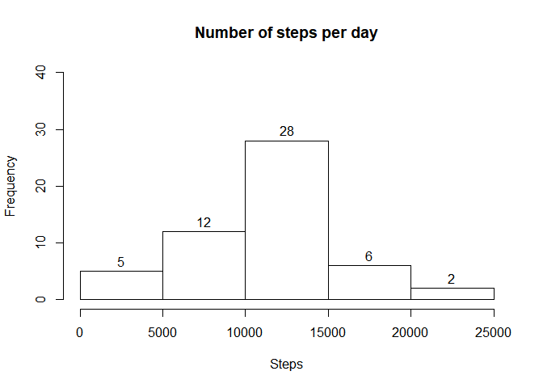
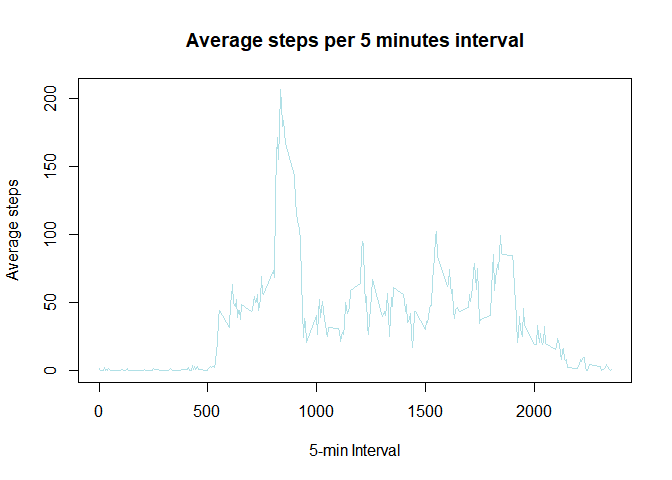
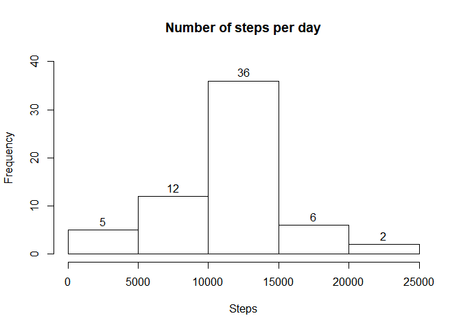
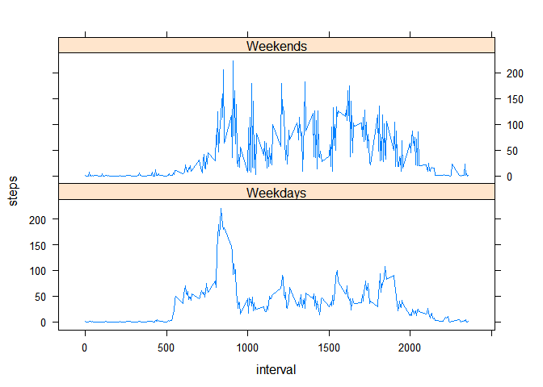

## Loading and preprocessing the data
Here is the code to load the dataset from repository. We also transform the date variable from factor to dates format.


```r
data <- read.csv("./activity/activity.csv")
data$date<- as.Date(data$date,"%Y-%m-%d")
```


## What is mean total number of steps taken per day?
1. To make the histogram we first aggregate the data by numer of steps taken per day and then plot a histogram. Here's the code:


```r
daily<- aggregate(steps~date,data,sum,na.rm=T)
hist(daily$steps,main = "Number of steps per day",xlab="Steps",labels = T,ylim = c(0,40))
```

<!-- -->

2. Mean and median of the total steps taken each day are:

```r
mean(daily$steps)
```

```
## [1] 10766.19
```

```r
median(daily$steps)
```

```
## [1] 10765
```


## What is the average daily activity pattern?

1. We calculte the average number of steps per 5 minutes interval using aggregate function and then plot the time series using following functions:


```r
average<- aggregate(steps~interval,data,mean,na.rm=T)
plot(average$interval,average$steps,xlab="5-min Interval",ylab="Average steps",
     type="l",col="powderblue",main="Average steps per 5 minutes interval")
```

<!-- -->

2. Here's the 5 minutes interval with maximum number of steps:


```r
average$interval[which.max(average$steps)]
```

```
## [1] 835
```


## Imputing missing values
1. Total number of missing values in the dataset are:


```r
sum(is.na(data$steps))
```

```
## [1] 2304
```

2. We will replace all the Nas in the steps variable with the mean of that 5 minutes interval.

3. Here's the code which creates a dataset No_NAs with no missing values.


```r
library(tidyverse)
```

```
## -- Attaching packages ------------------------------------------------------- tidyverse 1.3.0 --
```

```
## v ggplot2 3.3.0     v purrr   0.3.3
## v tibble  2.1.3     v dplyr   0.8.5
## v tidyr   1.0.2     v stringr 1.4.0
## v readr   1.3.1     v forcats 0.5.0
```

```
## -- Conflicts ---------------------------------------------------------- tidyverse_conflicts() --
## x dplyr::filter() masks stats::filter()
## x dplyr::lag()    masks stats::lag()
```

```r
No_NAs<- data%>%group_by(interval)%>%
        mutate(steps=ifelse(is.na(steps),mean(steps,na.rm=T),steps))
```

4. Histogram for the number of steps per day after all the missing values have been replaced is created.


```r
Daily1<- aggregate(steps~date,No_NAs,sum,na.rm=T)
hist(Daily1$steps,main = "Number of steps per day",xlab="Steps",labels = T,ylim = c(0,40))
```

<!-- -->
The overall distribution of the steps has not changed. But the frequency of steps between 10000 and 15000 has increased.  


## Are there differences in activity patterns between weekdays and weekends?

1. We created a factor variable named Days using following code:  

```r
No_NAs$Days<- factor(ifelse(weekdays(No_NAs$date)==c("Saturday","Sunday"),
                            "Weekends","Weekdays"))
```

2. A panel plot showing the number of steps taken across weekdays and weekends is:  

```r
Daily2<- aggregate(steps~Days+interval,data = No_NAs,mean,na.rm=T)

library(lattice)
xyplot(steps~interval|Days,Daily2,layout=c(1,2),type="l")
```

<!-- -->

